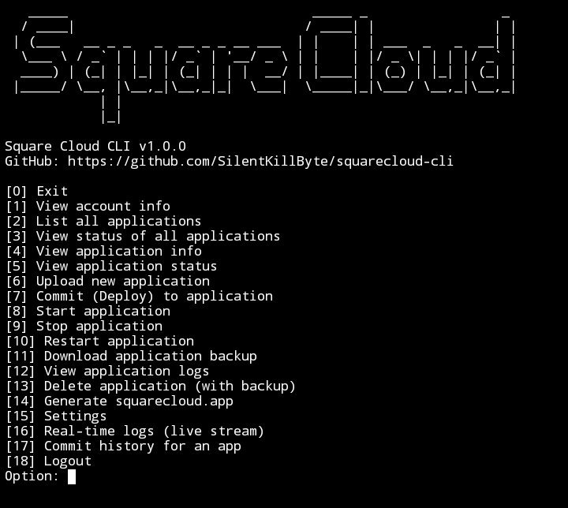

# Square Cloud CLI 

CLI para gerenciar aplicações na Square Cloud via terminal.



## Funcionalidades

- Deploy (.zip ou pasta direta)
- Suporte a `.squareignore` para ignorar arquivos (node_modules, .env, etc) no upload de pasta
- Logs em tempo real (stream)
- Backup automático local antes de qualquer novo commit (como medida de segurança)
- Gerador de arquivo de configuração (`squarecloud.app`).
- Atualização automática via GitHub (opcional)

## Instalação

Requer Node.js.

```bash
git clone https://github.com/SilentKillByte/squarecloud-cli.git
cd squarecloud-cli
npm install
npm start
```

## ⚠️ Nota:
 * Token: Fica salvo localmente em src/data/conta.json.
 * Backups: Os backups automáticos e downloads ficam salvos em src/data/backups/
 * .squareignore: Para usar o deploy via pasta, crie um arquivo .squareignore na raiz do seu projeto e liste o que não deve ser enviado (funciona igual ao .gitignore).
